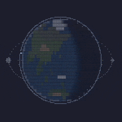

<a href="https://www.buymeacoffee.com/jasonfen"></a>

# Terminal Space Program

Terminal-native orbital-mechanics rocket simulator. A take on Kerbal Space
Program that lives in your terminal, distributed as a single static Go binary.

## Inspiration

I love **Kerbal Space Program**, I love **TUI Applications**. I decided the two should be married for when I'm bored and have a terminal available.

## The Game



By default, you spawn in an Apollo-style SIV-B in a 500km circular orbit. Switch targets to Moon (press t to switch and T to clear). Plant a Hohmann transfer + inclination change (press H). Or, fly it all manually. See **[Controls & flight guide](docs/controls.md)** for a quick tour, a launch walkthrough, and the full list of keys.

Plan transfers between planets and moons, fly your rocket off the pad and into orbit
by hand, rendezvous and dock, stage away spent boosters, and bring a capsule
home under parachute — all drawn with braille-canvas graphics and driven from
the keyboard. No mouse required, no GUI, just a single binary in your terminal.

Under the hood it's a real orbital-mechanics sim: gravity, fuel, atmospheric drag, and timing all
matter, the way they do in real life. Unlike KSP (without mods), the default game renders our solar system. Launches are hard, they take 7.5km/s for LEO - just like real life. The moon is inclined, the earth is tilted on its axis. To match the real solar systems, there are real life vessels with accurate loadouts of thrust.

Recently introduced: a familiar 1/10th-scale system named Lumen; home to a familiar planet, Kernel, with two moons, Cursor and Glyph - and a nearby red planet, Rust. A Lumen-specific vessel is scaled to that environment. It's a little rough appearance-wise as no textures have ported over to that system, but vessels fly and hit familiar Delta-V marks for launch, Cursor (Mun) transfers, etc. From a default game launch press TAB to cycle through the available solar systems until you reach Lumen. Press F to cycle to the planet Kernel, then press N to spawn a craft there.

Each vessel is bound for its lifetime to the system it spawns in — the simulator flies every vessel against its own system and the camera follows your *active* vessel's system, so a craft parked in Sol keeps orbiting while you fly in Lumen (TAB stays a browse-only camera toggle). Adding Lumen also changed the body catalog, so the on-disk save format moved to v8; older saves auto-migrate on load.

When your live trajectory is heading into a body's sphere of influence, the orbit map draws the full encounter arc ahead of arrival — entry, perilune, and exit — with a Perilune `⊕` marker and an always-on **SOI PASS** chip showing the altitude and time to closest approach. No need to target the body first. Every orbital marker (apoapsis, periapsis, nodes, closest approach, maneuver nodes) is now a single colored glyph: shape is type, color is type, brightness is state (nominal / counterfactual / alarm). To read an encounter up close, press `f` to focus the body it passes — the camera fits to the body's sphere of influence so the capture curve fills the canvas, and from there the view is yours: `+`/`-` zoom holds until you change focus, view, or system.

Recently introduced: an in-game **Vehicle Assembly Building (VAB)**. From the
main view press `Esc → [Build (VAB)]` to design your own rocket from fine
parts — compose engines, fuel tanks, command cores, antennas, and structure
into stages, stack the stages, mark dock seams for nose payloads, and watch a
live **Δv / TWR / mass** readout as you build. Editing is in place,
maneuver-form style: you open onto a stage, press `←/→` on its engine or tank
row to swap that part within its kind (the engine leads the stage's chemistry),
`+/-` to add more, and `enter` on a shipped catalog part (an S-IVB, a Falcon
booster) to **crack it open** into editable components and tweak from there. Set
a `t` **Σ Δv target** and a tank row will hint how many tanks close the gap.
Save a design and it shows up in the spawn form (`n`) alongside the built-in
craft, so you design once and launch many. Designs are portable files under
`~/.config/terminal-space-program/designs/` (KSP `.craft`-style); drop one into
the sibling `loadouts/` overlay dir to share it as a mod. Multiple engines in a
stage combine honestly (thrust adds, Isp is the thrust-weighted blend) and a
stage holds a single fuel chemistry, so everything you build flies on the same
honest physics as the shipped fleet.

Recently introduced: a multi-save system. `Esc → [Save Game]` / `[Load Game]`
opens one browser for every save — your named saves (create one with the
`＋ New save…` row, or overwrite an existing one), plus the managed quicksave
lane (`F5` to save, `F9` to instant-load, no confirm) and three rotating
autosaves (a real-time interval, 5 minutes by default and tunable in Settings,
plus one on quit). The old single `save.json` is auto-imported as a named save
the first time you launch this version and is left in place, untouched, as a
downgrade safety net. Saves are flat, independent files under
`~/.local/state/terminal-space-program/saves/` (`$XDG_STATE_HOME` if set) — no
save-schema change, so existing saves load exactly as before.

The visual foundation was lifted (with MIT attribution) from
[furan917/go-solar-system](https://github.com/furan917/go-solar-system). See
[NOTICE.md](NOTICE.md) for the full acknowledgments list.

## Install

### Homebrew (macOS / Linux)

```bash
brew install --cask jasonfen/tap/terminal-space-program
```

### Scoop (Windows)

```powershell
scoop bucket add jasonfen https://github.com/jasonfen/scoop-bucket
scoop install terminal-space-program
```

### Direct download

```bash
# Linux x86_64
curl -L https://github.com/jasonfen/terminal-space-program/releases/latest/download/terminal-space-program-linux-amd64.tar.gz | tar xz
./terminal-space-program
```

Replace `linux-amd64` with `linux-arm64`, `darwin-amd64`, `darwin-arm64`, or
`windows-amd64` (use the `.zip` variant on Windows).

No Go toolchain, no libc dance. `CGO_ENABLED=0` static binaries.

### Build from source

```bash
git clone https://github.com/jasonfen/terminal-space-program
cd terminal-space-program
go build ./cmd/terminal-space-program
./terminal-space-program
```

Requires Go 1.24 or newer.

## Command-line flags

By default the game opens with a vessel in low Earth orbit. Flags let you jump
straight to a different start — a system, a body to orbit or launch from, an
orbit altitude and inclination, or a named launch site:

```bash
terminal-space-program --orbit moon --altitude 100km          # 100 km lunar orbit
terminal-space-program --system Lumen --orbit kern --loadout Kern-Stack
terminal-space-program --orbit earth --altitude 400km --inclination 51.6
terminal-space-program --launch-site KSC --loadout Saturn-V    # on the pad
terminal-space-program --list-bodies --system Lumen           # discover names
terminal-space-program --version
```

`--version` and the `--list-*` discovery flags print and exit. See the
**[command-line reference](docs/cli.md)** for every flag, units, defaults, and
more examples.

## Multiplayer (ssh)

Host a shared session straight from your own game — no separate server:

```bash
terminal-space-program --serve                 # play AND accept guests (port 23234)
terminal-space-program serve invite dave       # mint a one-time invite code
ssh -p 23234 your-host                         # guests join from any terminal
```

Guests enroll once with the invite code (their ssh key becomes their identity)
and get their own persistent space program on your machine. Everyone warps
time **independently**: other players appear as dim "ghost" craft evaluated
at *your* clock, and the `O` session roster shows who's ahead or behind —
`s` sync-warps you forward to a player's time to fly formation. Warp clamps,
planted burns, and SOI transitions are all honored en route.

## Custom vehicles

Vehicle loadouts and stage parts are **data, not code**. Drop a `.json` file in
`~/.config/terminal-space-program/loadouts/` (or under `$XDG_CONFIG_HOME`) to add
your own loadouts and parts, or override a built-in by reusing its `id`. A loadout
is an ordered list of part references; a part is one atomic stage. Run
`terminal-space-program --list-loadouts` to see the merged catalog and confirm
yours loaded — a malformed file is skipped with a warning, never failing the rest.
See the [command-line reference](docs/cli.md#custom-vehicles) for the format.

## Learn more

- **[Controls & flight guide](docs/controls.md)** — a quick tour, a launch
  walkthrough, and the full list of keys.
- **[Constellation deployment](docs/constellation-deploy.md)** — dropping an
  evenly-spaced ring of comsats from one carrier, and the phasing-orbit math
  that makes it cheap.
- **[Command-line reference](docs/cli.md)** — every startup flag with examples.
- **[Version history](docs/version-history.md)** — what landed in each release.

## License

MIT. See [LICENSE](LICENSE).

## Star History

<a href="https://www.star-history.com/?repos=jasonfen%2Fterminal-space-program&type=date&legend=bottom-right">
 <picture>
   <source media="(prefers-color-scheme: dark)" srcset="https://api.star-history.com/chart?repos=jasonfen/terminal-space-program&type=date&theme=dark&legend=bottom-right&sealed_token=d7Clv4dIAuGhv05nJowEVzCtq1KRIRa2hCiTrzAjtCkFg4w_TFdAMZrJcRFGAa-pqKRbzr46rgcTUPIIT4ahVvZrDZfx0r1VLvvORQB_YDohDHhbl_7Xjte1AwP0CMd8AK2WuWDbj3rUVTajPbbuqANaBHi1BRbjkIQH54EFfbICSON0uenGXtSc-1-O" />
   <source media="(prefers-color-scheme: light)" srcset="https://api.star-history.com/chart?repos=jasonfen/terminal-space-program&type=date&legend=bottom-right&sealed_token=d7Clv4dIAuGhv05nJowEVzCtq1KRIRa2hCiTrzAjtCkFg4w_TFdAMZrJcRFGAa-pqKRbzr46rgcTUPIIT4ahVvZrDZfx0r1VLvvORQB_YDohDHhbl_7Xjte1AwP0CMd8AK2WuWDbj3rUVTajPbbuqANaBHi1BRbjkIQH54EFfbICSON0uenGXtSc-1-O" />
   
 </picture>
</a>
