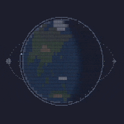

<a href="https://www.buymeacoffee.com/jasonfen"></a>

# Terminal Space Program

A Kerbal Space Program for your terminal: a real orbital-mechanics rocket
simulator drawn in braille-canvas graphics, driven entirely from the keyboard,
and shipped as a single static Go binary.



I love **Kerbal Space Program** and I love **TUI applications**, so I married
the two for whenever I'm bored and have a terminal available.

Plan transfers between planets and moons, fly your rocket off the pad and into
orbit by hand, rendezvous and dock, stage away spent boosters, and bring a
capsule home under parachute. No mouse, no GUI.

Under the hood it's a real sim: gravity, fuel, atmospheric drag, and timing all
matter the way they do in real life. The default game renders our own solar
system at full scale. Reaching low Earth orbit costs 7.5 km/s, the Moon's orbit
is inclined, the Earth is tilted on its axis, and the shipped vessels are real
rockets with accurate thrust and fuel loadouts.

## Features

- **Patched-conic physics.** Symplectic integration in free flight, RK4 under
  thrust with rocket-equation mass loss, sphere-of-influence handoffs, drag,
  and surface contact.
- **Five star systems.** Sol at full scale, plus **Lumen**, a familiar
  1/10th-scale system (Kernel with its moons Cursor and Glyph, and the red
  planet Rust) with its own scaled vessels, and three exoplanet systems.
  `TAB` cycles systems; a vessel stays bound to the system it spawned in.
- **Maneuver planning.** Plant and edit burn nodes, one-key Hohmann transfers
  with inclination change (`H`), Lambert and porkchop solvers, and a live
  projected post-burn orbit.
- **Encounter preview.** When your trajectory enters a body's sphere of
  influence the map draws the full arc (entry, perilune, exit) with an
  always-on **SOI PASS** chip. `j` steps a highlight through every marker the
  map drew and names it; `f` focuses the body so the capture curve fills the
  canvas.
- **Vehicle Assembly Building.** `Esc → [Build (VAB)]` composes engines,
  tanks, command cores, antennas, and structure into stages with a live
  **Δv / TWR / mass** readout. Crack open a shipped rocket to tweak it, set a
  Σ Δv target, and your designs appear in the spawn form next to the built-in
  fleet.
- **Staging, docking, and payloads.** Player-managed decouple chains, docking
  with a proximity view, nose payloads on dock seams, deployable comsats, and
  a CommNet link model.
- **Multiplayer over ssh.** Host from your own game; guests join from any
  terminal, each with their own persistent program and independent time.
- **Saves that stay out of the way.** Named saves, `F5`/`F9` quicksave, and
  rotating autosaves, all flat files under
  `~/.local/state/terminal-space-program/saves/`.
- **Data, not code.** Star systems, vessels, and parts are JSON; drop files in
  `~/.config/terminal-space-program/` to add or override any of them.

## Quick start

You spawn in an Apollo-style **S-IVB** in a 500 km circular Earth orbit.
Press `t` to target the Moon (`T` clears it), then `H` to plant a Hohmann
transfer with inclination change, or fly it all by hand. `F1` shows every key
in-game. See the **[controls & flight guide](docs/controls.md)** for a tour, a
launch walkthrough, and the full key list.

## Install

### Homebrew (macOS / Linux)

```bash
brew install --cask jasonfen/tap/terminal-space-program
```

### Scoop (Windows)

```powershell
scoop bucket add jasonfen https://github.com/jasonfen/scoop-bucket
scoop install terminal-space-program
```

### NixOS / Nixpkgs

[terminal-space-program](https://github.com/NixOS/nixpkgs/blob/master/pkgs/by-name/te/terminal-space-program/package.nix) is on [nixpkgs unstable](https://search.nixos.org/packages?channel=unstable&query=terminal-space-program) and is scheduled for the 26.11 stable release. Packaged and maintained by [@tomasriveral](https://github.com/tomasriveral), thank you!

To try it temporarily:

```bash
# legacy command
nix-shell -p terminal-space-program

# flake command
nix run github:nixos/nixpkgs/nixpkgs-unstable#terminal-space-program
```

For a permanent installation, add `pkgs.terminal-space-program` to `environment.systemPackages`, or to `home.packages` if you use Home Manager.

> [!NOTE]
> For nixpkgs-specific issues (outdated version, build failure, something not working on nixpkgs), please [open an issue on nixpkgs](https://github.com/NixOS/nixpkgs/issues) and ping the package maintainer @tomasriveral.

### Direct download

```bash
# Linux x86_64
curl -L https://github.com/jasonfen/terminal-space-program/releases/latest/download/terminal-space-program-linux-amd64.tar.gz | tar xz
./terminal-space-program
```

Replace `linux-amd64` with `linux-arm64`, `darwin-amd64`, `darwin-arm64`, or
`windows-amd64` (use the `.zip` variant on Windows).

No Go toolchain, no libc dance. `CGO_ENABLED=0` static binaries.

### Build from source

```bash
git clone https://github.com/jasonfen/terminal-space-program
cd terminal-space-program
go build ./cmd/terminal-space-program
./terminal-space-program
```

Requires Go 1.25 or newer.

## Command-line flags

By default the game opens with a vessel in low Earth orbit. Flags let you jump
straight to a different start: a system, a body to orbit or launch from, an
orbit altitude and inclination, or a named launch site.

```bash
terminal-space-program --orbit moon --altitude 100km          # 100 km lunar orbit
terminal-space-program --system Lumen --orbit kern --loadout Kern-Stack
terminal-space-program --orbit earth --altitude 400km --inclination 51.6
terminal-space-program --launch-site KSC --loadout Saturn-V    # on the pad
terminal-space-program --list-bodies --system Lumen           # discover names
terminal-space-program --version
```

`--version` and the `--list-*` discovery flags print and exit. See the
**[command-line reference](docs/cli.md)** for every flag, units, defaults, and
more examples.

## Multiplayer (ssh)

Host a shared session straight from your own game, no separate server:

```bash
terminal-space-program --serve                 # play AND accept guests (port 23234)
terminal-space-program serve invite dave       # mint a one-time invite code
ssh -p 23234 your-host                         # guests join from any terminal
```

Guests enroll once with an invite code and get their own persistent space
program on your machine. Everyone warps time independently; other players show
as ghost orbits on your map, and the `O` session roster lets you target, sync
to, spectate, or rendezvous-warp with them. Get close enough and your clocks
couple, so you can dock across players, hand over control of a shared stack,
and coordinate it all in the in-game chat (`~`).

The **[multiplayer guide](docs/multiplayer.md)** covers hosting from inside a
running game, admins, rendezvous warp and the terminal phase, cross-player
docking, and chat.

## Custom vehicles

Vehicle loadouts and stage parts are **data, not code**. Drop a `.json` file in
`~/.config/terminal-space-program/loadouts/` (or under `$XDG_CONFIG_HOME`) to add
your own loadouts and parts, or override a built-in by reusing its `id`. A loadout
is an ordered list of part references; a part is one atomic stage. Designs saved
from the VAB land in the sibling `designs/` directory in the same format. Run
`terminal-space-program --list-loadouts` to see the merged catalog and confirm
yours loaded; a malformed file is skipped with a warning, never failing the rest.
See the [command-line reference](docs/cli.md#custom-vehicles) for the format.

## Learn more

- **[Controls & flight guide](docs/controls.md)**: a quick tour, a launch
  walkthrough, and the full list of keys.
- **[Multiplayer guide](docs/multiplayer.md)**: hosting, independent time,
  rendezvous warp, cross-player docking, and chat.
- **[Constellation deployment](docs/constellation-deploy.md)**: dropping an
  evenly-spaced ring of comsats from one carrier, and the phasing-orbit math
  that makes it cheap.
- **[Command-line reference](docs/cli.md)**: every startup flag with examples.
- **[Version history](docs/version-history.md)**: what landed in each release.

## Credits and license

MIT. See [LICENSE](LICENSE).

The visual foundation was lifted (with MIT attribution) from
[furan917/go-solar-system](https://github.com/furan917/go-solar-system). See
[NOTICE.md](NOTICE.md) for the full acknowledgments list.

## Star History

<a href="https://www.star-history.com/?repos=jasonfen%2Fterminal-space-program&type=date&legend=bottom-right">
 <picture>
   <source media="(prefers-color-scheme: dark)" srcset="https://api.star-history.com/chart?repos=jasonfen/terminal-space-program&type=date&theme=dark&legend=bottom-right&sealed_token=dbwjcj7yk5KnzsyrH6GvpkZ9uYMbo-cqySjIk2qjHWcbz8FWAE3joeX41ruigOvYcuim7wL57pKOb3OLyvdIobXwjsULwza07zkUdQ13jeYLAF6M2qGxXykxRAoJcewhjzYYDGSDd3VaIzW8CKc2iv9Grg1Rz0-h3vkXpUPxhNfzGLar0_VyF4BnQfvj" />
   <source media="(prefers-color-scheme: light)" srcset="https://api.star-history.com/chart?repos=jasonfen/terminal-space-program&type=date&legend=bottom-right&sealed_token=dbwjcj7yk5KnzsyrH6GvpkZ9uYMbo-cqySjIk2qjHWcbz8FWAE3joeX41ruigOvYcuim7wL57pKOb3OLyvdIobXwjsULwza07zkUdQ13jeYLAF6M2qGxXykxRAoJcewhjzYYDGSDd3VaIzW8CKc2iv9Grg1Rz0-h3vkXpUPxhNfzGLar0_VyF4BnQfvj" />
   
 </picture>
</a>
