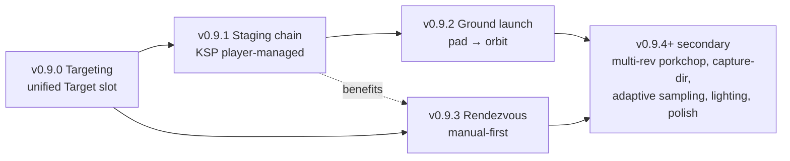

# v0.9 — the craft fleet grows up

## Context

`docs/state-of-game.md` §"Upcoming — v0.9 cycle plans" framed v0.9
as eleven candidate slices in priority order. This doc narrows that
menu to a committed cycle anchored on four slices the player can
exercise as one continuous workflow:

> Roll a launch vehicle to the pad, fly it to LEO through staged
> ascent, target another craft already on orbit, fly to a manual
> rendezvous, dock.

That workflow forces the cycle's headline: **staging, ground launch,
targeting, rendezvous**. Mission scripting defers entirely to v0.10
with the open eight-decision-point design pass intact (the rolled-
back v0.8.7 attempt is reference, not starting point). Cross-SOI
`PlanTransfer` and combined plane-shift + Hohmann remain L-tier
backlog — they're real work, just not in this cycle's path.

Slice ordering threads targeting first (small refactor that the
later slices consume), then staging (the largest), then ground
launch (chains on staging), then rendezvous (consumes targeting,
benefits from a richer post-staging fleet). Bandwidth-permitting
follow-ups trail.

## Status

| slice  | status   | tag       | notes |
|--------|----------|-----------|-------|
| v0.9.0 | shipped  | v0.9.0    | Targeting refactor: unified `World.Target` slot (kind ∈ {None, Body, Craft}), replaces the implicit body cursor; `t` / `T` cycle / clear; TARGET HUD; `H` / `I` planters consume the slot. Landed at ~280 production + ~200 tests (under the ~500 LOC estimate — no rendering snowball). |
| v0.9.1 | planned  | —         | Staging chain: KSP-style player-managed sequential decouples. `Spacecraft.Stages []Stage`; jettisoned stages spawn as passive cycle-able craft. Save schema v5→v6. |
| v0.9.2 | planned  | —         | Ground launch: `SpawnSpec.Launchpad` flag, surface-co-rotating spawn at altitude 0, LAUNCH HUD block, `circularize-from-pad` mission predicate. Reuses v0.8.4 atmosphere + surface clamp. |
| v0.9.3 | planned  | —         | Rendezvous tooling (manual-first): `BurnTargetPrograde`/`BurnTargetRetrograde` SAS modes, `NextClosestApproach` with live time + distance countdown in TARGET HUD. `PlanRendezvous` auto-plant is a stretch within the slice. |
| v0.9.4+ | bandwidth-permitting | — | Multi-rev porkchop UI + Lambert short/long picker, capture-direction toggle, predictor adaptive sampling, solar lighting + terminator + eclipses (research-first), polish bag. Picked in priority order; cycle ends when .0–.3 land + at least one of these. |

---

## Resolved scoping questions

Settled before writing this plan:

1. **Theme.** "The craft fleet grows up." Staging + launch + targeting +
   rendezvous anchor the cycle. Cross-SOI transfer and plane-shift +
   Hohmann stay backlog (state-of-game §3 / §4).
2. **Mission scripting deferred to v0.10.** The eight design decision
   points listed in `state-of-game-archive.md` §6 *Mission scripting /
   editor* stay open. The v0.8.7 rolled-back implementation is
   reference for implementation shape only — not a starting point.
   v0.10's pre-cycle checklist will reopen the design pass.
3. **Staging shape.** KSP-style **player-managed sequential
   decouples**, resolving open question
   [staging-continuity](state-of-game.md#staging-continuity). A `space`
   keystroke (when no maneuver form is open) drops the bottom stage;
   active-craft idx stays on the upper stage; jettisoned stages
   become passive cycle-able craft. Auto-managed staging (planner-
   planted stage events) deferred — reopen post-v0.9 only if
   playtest exposes friction.
4. **Composite-craft mass distribution.** Resolves open question
   [composite-mass-post-docking](state-of-game.md#composite-craft-mass-distribution-post-docking).
   Default: **sum thrust, mass-weighted average Isp**. Picked because
   it's the natural physics generalization (pooled mass-flow against
   pooled thrust gives the right TWR + the right Δv from the rocket
   equation), is deterministic, and degenerates correctly when one
   partner is RCS-only. `World.DockCrafts` updated as part of v0.9.1.
5. **Rendezvous scope.** **Manual flow is the slice's success
   metric** — player sets another craft as target, holds SAS at
   `BurnTargetPrograde`, throttles main engine, watches a live
   closest-approach time + distance countdown in the TARGET HUD,
   nulls v_rel at intercept with `BurnTargetRetrograde`. The
   `PlanRendezvous` auto-plant is a stretch goal within the slice;
   if it slips, the manual loop ships and auto-plant becomes a
   v0.9.4+ candidate.
6. **Targeting concept.** Unified `World.Target` slot (kind ∈ {None,
   Body, Craft}, with site reserved for future). One concept replaces
   today's implicit body cursor and absorbs the rendezvous-introduced
   target-craft idx. Every planner ("go to target", "match target
   plane", "rendezvous with target") consumes the same slot.
7. **Launch gravity-turn assist.** Manual-only for v0.9.2. The
   existing throttle (`z`/`x`) + WASDQE attitude controls plus the
   v0.8.6.2 throttle-change + upcoming-node warp clamps already
   handle the "first 10 minutes of ascent at low warp" need.
   Pitch-vs-altitude overlay deferred — reopen if playtest exposes
   friction.
8. **Cross-SOI `PlanTransfer` and plane-shift + Hohmann remain
   backlog.** Both are L-tier and explicitly out of scope for v0.9.
9. **Cadence.** Foundation-first: targeting → staging → launch →
   rendezvous. Targeting first because subsequent slices consume the
   slot; staging before launch because the launch vehicle is multi-
   stage; rendezvous last because it benefits from the richer
   post-staging fleet (manual loop tests against a recently
   jettisoned stage are the cheap success-metric scenario).
10. **v0.8.7 stays vacant.** Per the pre-cycle checklist; the rolled-
    back attempt's tag is not reused.

---

## Slices

### v0.9.0 — targeting (unified target slot)

Refactor that subsequent slices consume. Small in LOC but touches
the HUD and every planner call site that today reads the implicit
body cursor.

**Code surface (sim).**

- `internal/sim/target.go` (new) — mirrors the existing `Focus`
  pattern in `internal/sim/focus.go:9-24`:

  ```go
  type TargetKind int
  const (
      TargetNone TargetKind = iota
      TargetBody
      TargetCraft
      // TargetSite reserved; not populated until landing-site
      // targeting ships post-v0.9.
  )
  type Target struct {
      Kind     TargetKind
      BodyIdx  int    // when Kind==TargetBody
      CraftIdx int    // when Kind==TargetCraft
  }
  ```

- `World.Target Target` field. `World.SetTarget`,
  `World.CycleTarget`, `World.ClearTarget` mirror
  `World.SetFocus` / `World.CycleFocus` / `World.ResetFocus`.
  Cycle order (revised post-v0.9.0 hotfix): non-active sibling craft
  → bodies in active system → none → repeat. Crafts come first because
  Sol's 19-body catalog made the originally-planned bodies-first order
  unworkable (you'd press `t` 19 times to reach a spawned craft).
- `World.TargetState() (orbital.Vec3State, ok bool)` — resolves a
  target to its current heliocentric (or primary-frame, when
  `World.ActiveCraft()` is body-bound) state. Used by every
  consumer below.

**Code surface (planner consumers).**

- Audit every site that today reads an implicit body cursor:
  - `H` planted Hohmann (`internal/planner/transfer.go:154`
    `PlanIntraPrimaryHohmann`) → reads `World.Target`.
  - `I` plane-match (`internal/planner/inclination.go:70`
    `PlanInclinationChange`) → reads `World.Target`.
  - The body-cycle path that today implicitly drives the above.
- Planner functions themselves don't change signatures (they
  already take a target body / orbit explicitly); only the
  `cmd/terminal-space-program/` call sites change to read from
  `World.Target` instead of the cursor.

**Code surface (keys + HUD).**

- `t` cycles `World.Target`. `T` clears.
- TARGET HUD block, hidden when `Target.Kind == TargetNone`:
  - For `TargetBody`: name, body-equatorial Δi vs active craft,
    closest-encounter range (sample-then-bisect over predicted
    segments).
  - For `TargetCraft`: craft name + role, current range, |v_rel|.
    (v0.9.3 extends this with closest-approach time + distance.)

**Code surface (save).**

- Additive: `Target` struct embedded in the v5 payload —
  `omitempty` on a zero-value (`TargetNone`) means no schema bump
  needed. v5 saves load with `World.Target = Target{}` (None).

**Reused.**

- Pattern: `Focus` struct + cycle helpers in
  `internal/sim/focus.go` (the structural template).
- `bodies.BodyPosition` for resolving body targets.
- Predicted-segment cache for body closest-encounter.

**Estimate.** ~250 LOC + tests. **Apply 2× heuristic** — touches HUD
and every planner call site: plan ~500.

---

### v0.9.1 — staging chain (KSP-style player-managed)

The largest slice in v0.9. Adds multi-stage launch vehicles and
the `space` keystroke to drop the active stage.

**Code surface (Spacecraft.Stages).**

- `internal/spacecraft/spacecraft.go` — new `Stage` struct:

  ```go
  type Stage struct {
      DryMass       float64 // kg
      FuelMass      float64 // kg (current)
      FuelCapacity  float64 // kg (max)
      Thrust        float64 // N
      Isp           float64 // s
      MonopropMass  float64 // kg (current)
      MonopropCap   float64 // kg
      RCSThrust     float64 // N
      RCSIsp        float64 // s
      LoadoutID     string  // for spawn / save round-trip
  }
  ```

- `Spacecraft.Stages []Stage` (new). Active engine reads from
  `Stages[len-1]` (the top stage — the player's "main" craft post-
  decouple); existing single-stage propulsion fields become
  computed accessors that delegate to the top stage.
- `Spacecraft.WetMass`, `Spacecraft.DryMass`, `Spacecraft.Thrust`,
  `Spacecraft.Isp`, `Spacecraft.RCSThrust`, `Spacecraft.RCSIsp`,
  `Spacecraft.Monoprop`, `Spacecraft.MonopropCapacity` rewritten
  as Sum / Top accessors that walk `Stages` (sum dry+fuel mass
  across all stages, top-stage thrust/Isp).

**Code surface (loadouts).**

- `internal/spacecraft/loadouts.go` — extend the four existing
  loadouts:
  - `S-IVB-1`, `ICPS`, `RCS-tug`, `Lander` — existing single-
    stage loadouts get a `Stages: [{...current values}]` shim.
  - **New:** `Saturn-V` 3-stage launch vehicle for the v0.9.2
    ground-launch slice.
- Tuning (Saturn V class):
  - **S-IC** (booster): 2,290,000 kg wet / 130,000 kg dry /
    35,100 kN thrust / Isp 263 s.
  - **S-II** (sustainer): 480,000 / 40,000 / 5,140 kN / Isp 421 s.
  - **S-IVB** (insertion): 120,000 / 11,000 / 1,023 kN / Isp 421 s
    — the existing default loadout.
  - TWR > 1 at sea level on stage 1.

**Code surface (staging keystroke).**

- `cmd/terminal-space-program/keys.go` — `space` (when no maneuver
  form is open) calls `World.StageActive(craftIdx)`.
  `space` already toggles iterate-for-target inside `m` form
  (v0.8.6.3) — confined to no-form context to avoid clobbering.
- `World.StageActive(craftIdx int) (newCraftIdx, jettisonedIdx
  int, err error)` — pops `Stages[0]` (the bottom stage), spawns
  it as a passive `Spacecraft` at the active craft's exact
  position + velocity (with any residual fuel + monoprop on the
  jettisoned stage). Active idx stays on the upper craft.
- HUD STAGES block: lists per-stage thrust / Isp / fuel%, top
  stage highlighted.

**Code surface (composite-craft post-docking).**

- `World.DockCrafts` (`internal/sim/docking.go`, v0.8.3) updates
  per scoping decision #4: composite Δv reads `Σ thrust` /
  `mass-weighted Σ(Isp · thrust) / Σ thrust`. Active partner's
  `Stages` slice gains the docked partner's `Stages` appended on
  top (so undocking can split correctly along stage boundaries).

**Code surface (save).**

- Schema bump v5 → v6 with `Stages []Stage`. Pre-v6 saves migrate
  by wrapping current single-stage propulsion fields into
  `Stages: [{...}]`.
- `internal/save/save.go` — add `payloadV6` typed-migration
  function `v5to6(p5 *payloadV5) *payloadV6` following the
  existing chain.
- `internal/save/testdata/save-v5.json` corpus entry frozen.

**Reused.**

- v0.8.1 `payloadV5` typed-migration pattern.
- v0.8.3 `World.DockCrafts` (extended, not rewritten).
- v0.8.2 loadout catalog shape.

**Estimate.** ~700 LOC + tests + corpus.

---

### v0.9.2 — ground launch (pad → orbit)

Spawn a craft at altitude 0 on a rotating planet's surface,
co-moving with the surface. Manual gravity-turn flight. Composes
with v0.9.1 staging.

**Code surface (spawn).**

- `internal/sim/spawn.go` — `SpawnSpec.Launchpad bool` flag (new).
  When `true`:
  - Position: surface point at configurable latitude (default
    28.6°N — KSC), longitude per `SimTime` primary-meridian
    rotation, altitude 0.
  - Velocity: surface co-rotation only — `ω_body × r`, no
    orbital velocity.
  - The altitude / direction fields hide; a `Latitude` field
    appears in the spawn form.
- Spawn form (`screens.SpawnCraft`) gains a LAUNCH PAD toggle
  (default off).

**Code surface (HUD).**

- LAUNCH HUD block — visible when craft altitude < primary's
  atmosphere cutoff and craft has not yet achieved a stable orbit
  (`periapsis > primary.Radius`):
  - Altitude AGL (m → km).
  - Vertical-v (m/s).
  - Horizontal-v (m/s, surface-relative).
  - Downrange (km from launch point).
  - TWR (active stage thrust / current mass / surface gravity).

**Code surface (mission scaffold).**

- `internal/missions/missions.json` — new
  `circularize-from-pad` predicate variant. Starts at altitude 0
  on a surface; succeeds when stable orbit periapsis > 200 km.
- One starter mission entry exercising the full launch loop on
  the Saturn-V loadout.

**Reused.**

- `physics.ClampToSurface` (v0.8.4) — inverted as the spawn
  position resolver.
- `bodies.Atmosphere` (v0.8.4) — already drives the ascent drag
  profile; no new physics needed.
- v0.8.6.2 throttle-change + upcoming-node warp clamps — already
  enforce low-warp during the ascent burn.
- Existing throttle + WASDQE attitude controls — manual gravity
  turn is just a long burn from altitude 0 with staging events.

**Estimate.** ~400 LOC + tests + 1 mission. **Apply 2×
heuristic** — touches HUD + spawn UX: plan ~800.

---

### v0.9.3 — rendezvous tooling (manual-first)

The slice ships when the manual loop works end-to-end. Auto-plant
is a stretch within the slice.

**Success metric (manual loop).** With another craft set as target
via v0.9.0, the player holds SAS at `BurnTargetPrograde`, opens
the throttle, and watches the TARGET HUD's "next closest approach"
countdown shrink in real time. At intercept they flip SAS to
`BurnTargetRetrograde` and null v_rel. Approach + null-out is fully
manual; no node planting required.

**Code surface (manual loop — the gating work).**

- `internal/spacecraft/thrust.go` — extend `BurnMode` enum:

  ```go
  const (
      // ...existing six modes
      BurnTargetPrograde
      BurnTargetRetrograde
  )
  ```

  Direction unit vector along `v_active − v_target` (retrograde)
  or `v_target − v_active` (prograde). SAS holds these the same
  way it holds today's prograde / retrograde. Modes degrade to
  no-op when `World.Target.Kind != TargetCraft`.
- `internal/planner/rendezvous.go` (new) —

  ```go
  // NextClosestApproach finds the next time-to-encounter
  // between two craft along their predicted segments. Returns
  // (time, distance, v_rel) at closest approach within horizon.
  func NextClosestApproach(
      stateA, stateB orbital.Vec3State,
      primary bodies.CelestialBody,
      mu, horizon float64,
  ) (t, dist float64, vRel orbital.Vec3, err error)
  ```

  Sample-then-bisect over the existing predicted-segment cache.
  Recomputed each frame (or every N ticks if perf demands) so the
  HUD countdown is live.
- TARGET HUD block (extends v0.9.0 baseline) gains, when target
  is a craft:
  - Time-to-closest-approach (counts down to zero as encounter
    nears).
  - Distance-at-closest-approach.
  - Current range.
  - Current |v_rel|.
  - "DOCK READY" indicator (range < 50 m + |v_rel| < 0.1 m/s —
    gates on v0.8.3 `DockCrafts`).

**Code surface (auto-plant — stretch).**

- `PlanRendezvous(active, target, primary, mu) []ManeuverNode` —
  plants three nodes:
  1. Phasing burn at next AN/DN-aligned apse (sets up co-orbital
     geometry).
  2. Target-prograde nudge at predicted closest approach − Δt.
  3. Target-retrograde null at predicted closest approach.

  Iterates via `planner.IterateForTarget` (v0.6.2) to converge.
- Key: `R` plants `PlanRendezvous` when `World.Target.Kind ==
  TargetCraft`. Today's `R` re-Lamberts to body — disambiguate
  via target kind.
- If this slips, manual loop still ships; auto-plant becomes a
  v0.9.4+ candidate.

**Reused.**

- v0.8.4 time-aware `propagateStateWithPrimary`.
- v0.8.3 `World.DockCrafts`.
- v0.6.2 `planner.IterateForTarget` (auto-plant convergence).
- Predictor segment cache.

**Estimate.** ~350 LOC for the manual loop alone; ~500 with
auto-plant. **Apply 2× heuristic** (planner UX + HUD): plan ~700
for the full slice, ~500 if scoped to manual-only.

---

### v0.9.4+ — bandwidth-permitting (uncommitted)

Listed in priority order. Picked in priority order, not parallel;
cycle ends when v0.9.0–.3 land + at least one of these. **Not
committed slices.** Each gets its own scoping pass at pick time.

| Slice | Tier | Notes |
|---|---|---|
| Multi-rev porkchop UI + Lambert short/long picker | S | `LambertSolveRev` library-ready since v0.7.5. UI plumbs `nRev`, retrograde flag, short/long branch through the `m` form + porkchop heatmap. Useful once staging grows the fleet. ~200 LOC. |
| Capture-direction toggle | S | "Capture prograde-around-target" mode for auto-Hohmann arrival. Trades ~50–100 m/s for the right-direction capture. ~150 LOC. |
| Predictor adaptive sampling | M | Three-cycle carry-over; foundation shipped v0.8.4. Adaptive density ∝ orbit period / horizon. ~200 LOC. |
| Solar lighting + terminator + eclipses | M | **Research-first.** Investigate canvas-level ANSI 24-bit per-cell mixing as a `lipgloss` workaround before slicing. **Apply 2–3× heuristic** — touches rendering. ~600 LOC after research. |
| Polish bag | S | Spawn-form persistence, docking visual feedback, numbered craft slots (1–9). Bundle if cycle bandwidth allows. ~200 LOC. |

---

### Explicitly out of scope for v0.9

- **Mission scripting / editor.** Deferred to v0.10 with the open
  eight-decision-point design pass intact (see scoping #2).
- **Multiplayer implementation.** State-of-game §multiplayer
  `target=v0.9-stretch`; cycle bandwidth doesn't fit it.
- **N-body perturbations.** Major architectural change to the
  Kepler-warp-lock fast path. Backlog.
- **Multi-system spacecraft** (interstellar transfer math or jump
  drive). Backlog.
- **Cross-SOI `PlanTransfer`** (heliocentric → moon-of-other-
  planet). L-tier; remains in state-of-game backlog with the
  v0.5.7 `PlanIntraPrimaryHohmann` and v0.6.3 moon→parent paths
  as the existing coverage map.
- **Combined plane-shift + Hohmann.** L-tier; constrained Lambert
  variant binding work is too big for v0.9 with staging + launch
  + rendezvous already in flight. Remains backlog.
- **Atmospheric heating / structural overstress / aerodynamic
  shape-resolved C_D.** v0.8.4 leaves these out; v0.9 doesn't
  reopen.
- **Theme-file hot-reload, race-detector CI, `bodies.json` sibling
  overlay, Rings/Glyph JSON overrides.** All flagged for a future
  modding cycle.

---

## Sequencing



Targeting first because subsequent slices consume the slot
(mirrors the v0.8.1-before-v0.8.2 pattern). Staging chains into
launch because the launch vehicle is multi-stage. Rendezvous
consumes the targeting slot and benefits from a richer post-
staging fleet (the cheap success-metric scenario is "rendezvous
with the stage I just jettisoned"), but does not strictly depend
on staging — the slice could ship before .1 / .2 if cycle order
shifts.

**Suggested cadence.** Targeting (.0) ships first as foundation.
Staging (.1) is the heaviest slice and lands next. Launch (.2)
chains immediately on staging. Rendezvous (.3) closes the
headline. Bandwidth-permitting picks (.4+) trail in priority
order, one at a time.

---

## Deferred to v0.10+

Carried from `state-of-game.md` §"Provisional slice candidates"
and the v0.8 retrospective; not in v0.9:

- **Mission scripting / editor (v0.10 headline).** Eight-decision-
  point design pass first; v0.8.7 rolled-back artifacts as
  reference for shape only.
- **Cross-SOI `PlanTransfer`.** L-tier; remains backlog.
- **Combined plane-shift + Hohmann.** L-tier; remains backlog.
- **Multiplayer implementation.** Architecture spike v0.6.6 still
  current; foundations in. v0.10 stretch at earliest.
- **N-body perturbations.** Indefinite.
- **Multi-system spacecraft.** Indefinite.
- **Solar lighting + terminator + eclipses.** Research-first; may
  pick into v0.9.4+ if cycle bandwidth allows, otherwise v0.10.
- **Predictor adaptive sampling.** Three-cycle carry-over; same
  pickup conditions.
- **Theme-file hot-reload, `bodies.json` sibling overlay,
  Rings/Glyph JSON overrides, race-detector CI.** Modding-cycle
  items.
- **Drag-to-edit on planted nodes.** v0.8.6 click-to-edit-replace
  remains.
- **Atmospheric heating, aerodynamic shape modelling.**
  Indefinite.
- **Numbered craft slots (`1`–`9`).** Picks into v0.9.4+ polish
  bag if fleet grows past 4 craft routinely.

---

## Open questions for v0.9

Carry-overs from v0.8 retrospective + newly opened during scoping:

**Carry-overs**

- **Inter-SOI `PlanTransfer` capture** (heliocentric → moon-of-
  other-planet). Deferred from v0.8 boundary; remains backlog.
- **Combined plane-shift + Hohmann.** Substantial; remains
  backlog.
- **Capture-direction toggle.** Picks into v0.9.4+.
- **Predictor adaptive sampling.** Picks into v0.9.4+.
- **Solar lighting + terminator + eclipses.** Research-first;
  picks into v0.9.4+ or v0.10.
- **RCS budget for docking** (v0.8.3 carryover). Reopen tuning
  once the manual rendezvous loop in v0.9.3 generates real usage
  data.
- **Drag-aware predictor performance / atmosphere co-rotation at
  high altitude** (v0.8.4 carryovers). Reopen if launch slice
  exposes it.
- **Sim-time rotation at high warp** (v0.8.5 carryover). Reopen
  if distracting.
- **Theme-file hot-reload, `bodies.json` sibling overlay** —
  modding-cycle items.
- **Multi-rev porkchop / Lambert short-long branch** — picks into
  v0.9.4+.

**Newly opened from v0.9 scoping**

- **Stage-event predicate** (auto-managed staging — planner plants
  stage events alongside burn nodes). v0.9.1 ships KSP-style
  player-managed only; reopen post-v0.9 if playtest exposes
  friction.
- **Site target kind.** `TargetSite` reserved in `Target` struct
  but not populated until landing-site targeting ships
  (post-v0.9).
- **Target-on-canvas mouse interaction.** v0.9.0 ships keyboard
  cycle (`t`); click-to-target follows v0.6.4 pattern. Reopen if
  the cycle key reads as friction.
- **Launch gravity-turn assist.** Manual-only for v0.9.2 (decision
  #7); reopen if playtest exposes friction.
- **`PlanRendezvous` auto-plant scope.** v0.9.3 ships manual loop
  as the gate; auto-plant is a stretch within the slice. If it
  slips, becomes a v0.9.4+ candidate.
- **Composite-craft engine when stages dock** (extension of #4).
  v0.9.1 picks sum-thrust / mass-weighted-Isp; reopen if the
  rule reads wrong when a stage docks onto a partner with a
  different fuel type.
- **`space` keystroke conflict.** v0.9.1 confines staging to
  no-form context to avoid clobbering v0.8.6.3's iterate-for-
  target toggle. Reopen if a third `space` consumer wants in.

---

Update `docs/state-of-game.md` at each minor / patch boundary so
the snapshot stays current; close out v0.9 cycle questions there
once shipped.
