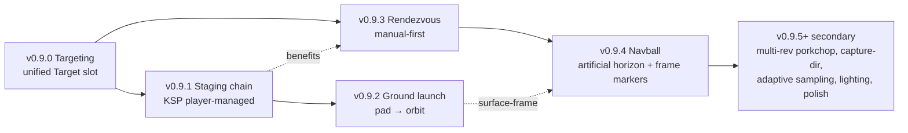

# v0.9 — the craft fleet grows up

## Context

`docs/state-of-game.md` §"Upcoming — v0.9 cycle plans" framed v0.9
as eleven candidate slices in priority order. This doc narrows that
menu to a committed cycle anchored on **four workflow slices** the
player can exercise as one continuous workflow plus **one operational-
support slice** (a navball) that lands once the workflow primitives
exist for it to display.

Workflow:

> Roll a launch vehicle to the pad, fly it to LEO through staged
> ascent, target another craft already on orbit, fly to a manual
> rendezvous, dock.

That forces the cycle's headline: **staging, ground launch,
targeting, rendezvous**. The navball (.4) lands after rendezvous so
it has the full set of target-relative direction vectors to display.
Mission scripting defers entirely to v0.10 with the open eight-
decision-point design pass intact (the rolled-back v0.8.7 attempt
is reference, not starting point). Cross-SOI `PlanTransfer` and
combined plane-shift + Hohmann remain L-tier backlog — they're real
work, just not in this cycle's path.

Slice ordering threads targeting first (small refactor that the
later slices consume), then staging (the largest), then ground
launch (chains on staging), then rendezvous (consumes targeting,
benefits from a richer post-staging fleet), then navball (consumes
all the burn-mode direction vectors the prior slices land).
Bandwidth-permitting follow-ups trail in v0.9.5+.

## Status

| slice  | status   | tag       | notes |
|--------|----------|-----------|-------|
| v0.9.0 | shipped  | v0.9.0    | Targeting refactor: unified `World.Target` slot (kind ∈ {None, Body, Craft}), replaces the implicit body cursor; `t` / `T` cycle / clear; TARGET HUD; `H` / `I` planters consume the slot. Landed at ~280 production + ~200 tests (under the ~500 LOC estimate — no rendering snowball). |
| v0.9.1 | shipped  | v0.9.1    | Staging chain: KSP-style player-managed sequential decouples. `Spacecraft.Stages []Stage` source-of-truth; flat propulsion fields become derived shadow-mirror via `SyncFields`. Saturn-V 3-stage loadout (S-IC + S-II + S-IVB, TWR>1 sea level). `space` keystroke decouples bottom stage; jettisoned stages spawn as passive cycle-able craft. STAGES HUD block. Composite-craft post-docking concatenates Stages. Save schema v5→v6 with typed migration. ~500 production + ~300 tests = ~800 LOC; close to ~700 estimate. |
| v0.9.2 | in flight (work-in-progress) | branch only | Ground launch primitives: `SpawnSpec.Launchpad` flag, surface-co-rotating spawn at altitude 0, LAUNCH HUD block, `saturn-v-pad-to-leo` mission, surface-frame SAS modes (`W` / `S`), pitch trim (`<` / `>` / `\`, 10° step), per-stage `BallisticCoefficient` for realistic Saturn V drag, Landed-state default SAS = radial+. **Branch is feature-complete but reaching orbit by hand is unreliable.** Manual ascent without a gravity-turn assist routinely undershoots; closing this is gated on a v0.9.5+ ergonomic pass. Slice ships unmerged (PR #51) until either the ergonomic pass lands or the user accepts the WIP state. |
| v0.9.3 | in flight (awaiting playtest) | branch only | Rendezvous tooling shipped on branch `v0.9.3-rendezvous` (commits `65fb268` core + `a481d6d` nav-mode cycle). All four target-relative SAS modes (`BurnTargetPrograde` / `BurnTargetRetrograde` / `BurnTarget` / `BurnAntiTarget`); `planner.NextClosestApproach` with live TCA / CA / DOCK READY readouts in TARGET HUD; `m` planner form integration (4 modes selectable + `next closest approach` trigger event + `ManeuverNode.TargetCraftIdx` captured-at-plant with save round-trip + stale-target no-op). **KSP-style `NavMode` cycle pulled forward from v0.9.4** — `;` rotates Orbit → Surface → Target (skipped when no craft target); the same `w` `s` `a` `d` `q` `e` axis keys reinterpret per mode (NavTarget: `w` `s` = TargetPrograde/Retrograde, `q` `e` = Target/AntiTarget). Auto-snap NavTarget → NavOrbit on target clear; persisted in save (omitempty). `PlanRendezvous` auto-plant deferred to v0.9.5+. Slice ships unmerged until manual rendezvous loop playtests end-to-end. |
| v0.9.4 | planned  | —         | Navball: bottom-right HUD region showing artificial horizon + projected attitude markers (prograde/retrograde/normal±/radial±, plus the v0.9.3 target-relative pairs when in target mode). **Mode-cycle controls (`;`) and intent-vs-frame translation already landed in v0.9.3** — v0.9.4 is now scoped to the *visualization* (sphere render + projected markers + frame-aware overlay). Reuses the body-rendering sphere pipeline (`SubObserverPointDeg` + per-pixel texture) so the projection math is solved infrastructure. **Apply 3× rendering-snowball heuristic.** |
| v0.9.5+ | bandwidth-permitting | — | Multi-rev porkchop UI + Lambert short/long picker, capture-direction toggle, predictor adaptive sampling, solar lighting + terminator + eclipses (research-first), polish bag. Picked in priority order; cycle ends when .0–.4 land + at least one of these (or just .0–.4 if bandwidth tightens). |

---

## Resolved scoping questions

Settled before writing this plan:

1. **Theme.** "The craft fleet grows up." Staging + launch + targeting +
   rendezvous anchor the cycle. Cross-SOI transfer and plane-shift +
   Hohmann stay backlog (state-of-game §3 / §4).
2. **Mission scripting deferred to v0.10.** The eight design decision
   points listed in `state-of-game-archive.md` §6 *Mission scripting /
   editor* stay open. The v0.8.7 rolled-back implementation is
   reference for implementation shape only — not a starting point.
   v0.10's pre-cycle checklist will reopen the design pass.
3. **Staging shape.** KSP-style **player-managed sequential
   decouples**, resolving open question
   [staging-continuity](state-of-game.md#staging-continuity). A `space`
   keystroke (when no maneuver form is open) drops the bottom stage;
   active-craft idx stays on the upper stage; jettisoned stages
   become passive cycle-able craft. Auto-managed staging (planner-
   planted stage events) deferred — reopen post-v0.9 only if
   playtest exposes friction.
4. **Composite-craft mass distribution.** Resolves open question
   [composite-mass-post-docking](state-of-game.md#composite-craft-mass-distribution-post-docking).
   Default: **sum thrust, mass-weighted average Isp**. Picked because
   it's the natural physics generalization (pooled mass-flow against
   pooled thrust gives the right TWR + the right Δv from the rocket
   equation), is deterministic, and degenerates correctly when one
   partner is RCS-only. `World.DockCrafts` updated as part of v0.9.1.
5. **Rendezvous scope.** **Manual flow is the slice's success
   metric** — player sets another craft as target, holds SAS at
   `BurnTargetPrograde`, throttles main engine, watches a live
   closest-approach time + distance countdown in the TARGET HUD,
   nulls v_rel at intercept with `BurnTargetRetrograde`. The
   `PlanRendezvous` auto-plant is a stretch goal within the slice;
   if it slips, the manual loop ships and auto-plant becomes a
   v0.9.5+ candidate.
6. **Targeting concept.** Unified `World.Target` slot (kind ∈ {None,
   Body, Craft}, with site reserved for future). One concept replaces
   today's implicit body cursor and absorbs the rendezvous-introduced
   target-craft idx. Every planner ("go to target", "match target
   plane", "rendezvous with target") consumes the same slot.
7. **Launch gravity-turn assist.** Manual-only for v0.9.2. The
   existing throttle (`z`/`x`) + WASDQE attitude controls plus the
   v0.8.6.2 throttle-change + upcoming-node warp clamps already
   handle the "first 10 minutes of ascent at low warp" need.
   Pitch-vs-altitude overlay deferred — reopen if playtest exposes
   friction.
8. **Cross-SOI `PlanTransfer` and plane-shift + Hohmann remain
   backlog.** Both are L-tier and explicitly out of scope for v0.9.
9. **Cadence.** Foundation-first: targeting → staging → launch →
   rendezvous → navball. Targeting first because subsequent slices
   consume the slot; staging before launch because the launch
   vehicle is multi-stage; rendezvous before navball because the
   navball's target-frame markers consume the v0.9.3 target-relative
   `BurnMode` directions; navball last so the surface-frame branch
   has v0.9.2 ground-launch primitives to display.
10. **v0.8.7 stays vacant.** Per the pre-cycle checklist; the rolled-
    back attempt's tag is not reused.

---

## Slices

### v0.9.0 — targeting (unified target slot)

Refactor that subsequent slices consume. Small in LOC but touches
the HUD and every planner call site that today reads the implicit
body cursor.

**Code surface (sim).**

- `internal/sim/target.go` (new) — mirrors the existing `Focus`
  pattern in `internal/sim/focus.go:9-24`:

  ```go
  type TargetKind int
  const (
      TargetNone TargetKind = iota
      TargetBody
      TargetCraft
      // TargetSite reserved; not populated until landing-site
      // targeting ships post-v0.9.
  )
  type Target struct {
      Kind     TargetKind
      BodyIdx  int    // when Kind==TargetBody
      CraftIdx int    // when Kind==TargetCraft
  }
  ```

- `World.Target Target` field. `World.SetTarget`,
  `World.CycleTarget`, `World.ClearTarget` mirror
  `World.SetFocus` / `World.CycleFocus` / `World.ResetFocus`.
  Cycle order (revised post-v0.9.0 hotfix): non-active sibling craft
  → bodies in active system → none → repeat. Crafts come first because
  Sol's 19-body catalog made the originally-planned bodies-first order
  unworkable (you'd press `t` 19 times to reach a spawned craft).
- `World.TargetState() (orbital.Vec3State, ok bool)` — resolves a
  target to its current heliocentric (or primary-frame, when
  `World.ActiveCraft()` is body-bound) state. Used by every
  consumer below.

**Code surface (planner consumers).**

- Audit every site that today reads an implicit body cursor:
  - `H` planted Hohmann (`internal/planner/transfer.go:154`
    `PlanIntraPrimaryHohmann`) → reads `World.Target`.
  - `I` plane-match (`internal/planner/inclination.go:70`
    `PlanInclinationChange`) → reads `World.Target`.
  - The body-cycle path that today implicitly drives the above.
- Planner functions themselves don't change signatures (they
  already take a target body / orbit explicitly); only the
  `cmd/terminal-space-program/` call sites change to read from
  `World.Target` instead of the cursor.

**Code surface (keys + HUD).**

- `t` cycles `World.Target`. `T` clears.
- TARGET HUD block, hidden when `Target.Kind == TargetNone`:
  - For `TargetBody`: name, body-equatorial Δi vs active craft,
    closest-encounter range (sample-then-bisect over predicted
    segments).
  - For `TargetCraft`: craft name + role, current range, |v_rel|.
    (v0.9.3 extends this with closest-approach time + distance.)

**Code surface (save).**

- Additive: `Target` struct embedded in the v5 payload —
  `omitempty` on a zero-value (`TargetNone`) means no schema bump
  needed. v5 saves load with `World.Target = Target{}` (None).

**Reused.**

- Pattern: `Focus` struct + cycle helpers in
  `internal/sim/focus.go` (the structural template).
- `bodies.BodyPosition` for resolving body targets.
- Predicted-segment cache for body closest-encounter.

**Estimate.** ~250 LOC + tests. **Apply 2× heuristic** — touches HUD
and every planner call site: plan ~500.

---

### v0.9.1 — staging chain (KSP-style player-managed)

The largest slice in v0.9. Adds multi-stage launch vehicles and
the `space` keystroke to drop the active stage.

**Code surface (Spacecraft.Stages).**

- `internal/spacecraft/spacecraft.go` — new `Stage` struct:

  ```go
  type Stage struct {
      DryMass       float64 // kg
      FuelMass      float64 // kg (current)
      FuelCapacity  float64 // kg (max)
      Thrust        float64 // N
      Isp           float64 // s
      MonopropMass  float64 // kg (current)
      MonopropCap   float64 // kg
      RCSThrust     float64 // N
      RCSIsp        float64 // s
      LoadoutID     string  // for spawn / save round-trip
  }
  ```

- `Spacecraft.Stages []Stage` (new). Active engine reads from
  `Stages[len-1]` (the top stage — the player's "main" craft post-
  decouple); existing single-stage propulsion fields become
  computed accessors that delegate to the top stage.
- `Spacecraft.WetMass`, `Spacecraft.DryMass`, `Spacecraft.Thrust`,
  `Spacecraft.Isp`, `Spacecraft.RCSThrust`, `Spacecraft.RCSIsp`,
  `Spacecraft.Monoprop`, `Spacecraft.MonopropCapacity` rewritten
  as Sum / Top accessors that walk `Stages` (sum dry+fuel mass
  across all stages, top-stage thrust/Isp).

**Code surface (loadouts).**

- `internal/spacecraft/loadouts.go` — extend the four existing
  loadouts:
  - `S-IVB-1`, `ICPS`, `RCS-tug`, `Lander` — existing single-
    stage loadouts get a `Stages: [{...current values}]` shim.
  - **New:** `Saturn-V` 3-stage launch vehicle for the v0.9.2
    ground-launch slice.
- Tuning (Saturn V class):
  - **S-IC** (booster): 2,290,000 kg wet / 130,000 kg dry /
    35,100 kN thrust / Isp 263 s.
  - **S-II** (sustainer): 480,000 / 40,000 / 5,140 kN / Isp 421 s.
  - **S-IVB** (insertion): 120,000 / 11,000 / 1,023 kN / Isp 421 s
    — the existing default loadout.
  - TWR > 1 at sea level on stage 1.

**Code surface (staging keystroke).**

- `cmd/terminal-space-program/keys.go` — `space` (when no maneuver
  form is open) calls `World.StageActive(craftIdx)`.
  `space` already toggles iterate-for-target inside `m` form
  (v0.8.6.3) — confined to no-form context to avoid clobbering.
- `World.StageActive(craftIdx int) (newCraftIdx, jettisonedIdx
  int, err error)` — pops `Stages[0]` (the bottom stage), spawns
  it as a passive `Spacecraft` at the active craft's exact
  position + velocity (with any residual fuel + monoprop on the
  jettisoned stage). Active idx stays on the upper craft.
- HUD STAGES block: lists per-stage thrust / Isp / fuel%, top
  stage highlighted.

**Code surface (composite-craft post-docking).**

- `World.DockCrafts` (`internal/sim/docking.go`, v0.8.3) updates
  per scoping decision #4: composite Δv reads `Σ thrust` /
  `mass-weighted Σ(Isp · thrust) / Σ thrust`. Active partner's
  `Stages` slice gains the docked partner's `Stages` appended on
  top (so undocking can split correctly along stage boundaries).

**Code surface (save).**

- Schema bump v5 → v6 with `Stages []Stage`. Pre-v6 saves migrate
  by wrapping current single-stage propulsion fields into
  `Stages: [{...}]`.
- `internal/save/save.go` — add `payloadV6` typed-migration
  function `v5to6(p5 *payloadV5) *payloadV6` following the
  existing chain.
- `internal/save/testdata/save-v5.json` corpus entry frozen.

**Reused.**

- v0.8.1 `payloadV5` typed-migration pattern.
- v0.8.3 `World.DockCrafts` (extended, not rewritten).
- v0.8.2 loadout catalog shape.

**Estimate.** ~700 LOC + tests + corpus.

---

### v0.9.2 — ground launch (pad → orbit)

Spawn a craft at altitude 0 on a rotating planet's surface,
co-moving with the surface. Manual gravity-turn flight. Composes
with v0.9.1 staging.

**Code surface (spawn).**

- `internal/sim/spawn.go` — `SpawnSpec.Launchpad bool` flag (new).
  When `true`:
  - Position: surface point at configurable latitude (default
    28.6°N — KSC), longitude per `SimTime` primary-meridian
    rotation, altitude 0.
  - Velocity: surface co-rotation only — `ω_body × r`, no
    orbital velocity.
  - The altitude / direction fields hide; a `Latitude` field
    appears in the spawn form.
- Spawn form (`screens.SpawnCraft`) gains a LAUNCH PAD toggle
  (default off).

**Code surface (HUD).**

- LAUNCH HUD block — visible when craft altitude < primary's
  atmosphere cutoff and craft has not yet achieved a stable orbit
  (`periapsis > primary.Radius`):
  - Altitude AGL (m → km).
  - Vertical-v (m/s).
  - Horizontal-v (m/s, surface-relative).
  - Downrange (km from launch point).
  - TWR (active stage thrust / current mass / surface gravity).

**Code surface (mission scaffold).**

- `internal/missions/missions.json` — new
  `circularize-from-pad` predicate variant. Starts at altitude 0
  on a surface; succeeds when stable orbit periapsis > 200 km.
- One starter mission entry exercising the full launch loop on
  the Saturn-V loadout.

**Reused.**

- `physics.ClampToSurface` (v0.8.4) — inverted as the spawn
  position resolver.
- `bodies.Atmosphere` (v0.8.4) — already drives the ascent drag
  profile; no new physics needed.
- v0.8.6.2 throttle-change + upcoming-node warp clamps — already
  enforce low-warp during the ascent burn.
- Existing throttle + WASDQE attitude controls — manual gravity
  turn is just a long burn from altitude 0 with staging events.

**Estimate.** ~400 LOC + tests + 1 mission. **Apply 2×
heuristic** — touches HUD + spawn UX: plan ~800.

#### v0.9.2 retrospective — work-in-progress

The slice landed all the planned primitives + several unplanned add-
ons (surface-frame SAS, pitch trim, per-stage ballistic coefficient,
Landed integration bypass, body-fixed↔world transforms aligned with
the renderer's tilted axis frame), but **manual ascent to a stable
LEO is unreliable at sign-off.** A representative attempt with the
suggested gravity turn (vertical until 3–5 km, trim east 20–30°,
switch to surface-prograde once v_horiz > 500 m/s, stage when fuel
hits zero) regularly drains S-IVB with periapsis still negative.

Likely contributing factors:

- No gravity-turn assist. The gating decision (#7) was "manual-only
  for v0.9.2" with reopen-if-friction. Friction is now confirmed.
- Throttle / pitch timing is stiff — a 10° pitch step gives
  reasonable initial pitch-over but mid-ascent fine-tuning at 1°
  resolution is fiddly.
- The Saturn V tuning is sea-level-realistic, which means the real
  ascent profile is what KSP's "Mechjeb" autopilot smooths in real
  KSP. Without similar assist, hand-flying to ~7.8 km/s of horizontal
  velocity within the fuel budget is tight.

Carrying-over decisions:

1. Slice ships **unmerged**. PR #51 stays open as the canonical WIP
   reference. Docs (state-of-game.md, README, this plan) are
   updated to reflect WIP. Commit `01e61ef` is the
   feature-complete sign-off point.
2. **Reopen open-question #7 (launch gravity-turn assist).**
   Promoted from "manual-only, reopen if playtest exposes" to a
   committed v0.9.5+ candidate with two options on the table: (a)
   target pitch-vs-altitude overlay (lightweight HUD addition that
   shows where the player *should* be pointing, leaves flying
   manual), or (b) autopilot toggle that drives throttle + attitude
   along a pre-baked Saturn V profile.
3. Cycle order does not change. v0.9.3 (rendezvous) is unblocked
   because it operates on already-orbiting craft — it doesn't
   depend on a working pad-to-LEO loop. v0.9.4 (navball) consumes
   v0.9.3's burn-mode primitives, not v0.9.2's surface-frame.
4. The WIP primitives (surface SAS, pitch trim, LAUNCH HUD,
   launchpad spawn, per-stage BC, Landed integration) **are not**
   reverted — they're foundation that the gravity-turn assist will
   layer on top of. Future polish slice extends, doesn't replace.

**Suggested launch sequence (for the WIP loop).** Documented in
README §"Surface launches (WIP)"; mirrored here so future cycle
planning has the context inline:

> 1. `n` → POSITION launchpad → LATITUDE 28.6° (KSC) → CRAFT TYPE
>    Saturn V → Enter. SAS comes up at radial+.
> 2. `z` (full throttle), `b` (engage). S-IC lifts vertical.
> 3. At ~3–5 km, tap `>` 2–3× to trim 20–30° east.
> 4. As surface velocity passes 500 m/s, press `W` for surface-
>    prograde SAS, `\` to clear trim.
> 5. `space` decouples spent S-IC; continue burn through S-II →
>    S-IVB.
> 6. Mission `saturn-v-pad-to-leo` passes when periapsis > 200 km.
>    In practice this often *doesn't* close on a single attempt —
>    that's the WIP.

---

### v0.9.3 — rendezvous tooling (manual-first)

The slice ships when the manual loop works end-to-end. Auto-plant
is a stretch within the slice.

**Success metric (manual loop).** With another craft set as target
via v0.9.0, the player holds SAS at `BurnTargetPrograde`, opens
the throttle, and watches the TARGET HUD's "next closest approach"
countdown shrink in real time. At intercept they flip SAS to
`BurnTargetRetrograde` and null v_rel. Approach + null-out is fully
manual; no node planting required.

**Secondary metric (planted-node workflow).** The manual SAS loop
above is the gating work, but the same primitives expose to the
`m` planner form: the player picks any of the four target-relative
modes, picks `next closest approach` as the fire-at trigger, sets a
Δv, and the node fires at the encounter with the target-relative
direction resolved at fire-time. KSP-style "burn 3.4 m/s target-
retrograde at nearest approach" works as a single planted node,
not a real-time stick exercise.

**Code surface (manual loop — the gating work).**

- `internal/spacecraft/thrust.go` — extend `BurnMode` enum with two
  pairs (KSP SAS naming):

  ```go
  const (
      // ...existing six modes

      // Velocity-relative (close / open relative velocity). The
      // primary tool for the manual rendezvous loop — close v_rel
      // on approach, null at closest approach.
      BurnTargetPrograde   // direction: (v_target − v_active).Unit()
      BurnTargetRetrograde // direction: (v_active − v_target).Unit()

      // Position-relative (push toward / away from target's
      // current position). Useful for sub-m/s proximity-ops nudges
      // after v_rel is nulled — drift in, fine-tune docking offset.
      BurnTarget     // direction: (r_target − r_active).Unit()
      BurnAntiTarget // direction: (r_active − r_target).Unit()
  )
  ```

  All four SAS-hold the same way today's prograde / retrograde
  hold. All four degrade to no-op when `World.Target.Kind !=
  TargetCraft` (body targets reuse `H` / `I`; position-relative on
  a body would just be radial-out / radial-in toward the body
  centre, which the existing `BurnRadialOut` / `BurnRadialIn`
  already cover relative to the active craft's primary).
- `internal/planner/rendezvous.go` (new) —

  ```go
  // NextClosestApproach finds the next time-to-encounter
  // between two craft along their predicted segments. Returns
  // (time, distance, v_rel) at closest approach within horizon.
  func NextClosestApproach(
      stateA, stateB orbital.Vec3State,
      primary bodies.CelestialBody,
      mu, horizon float64,
  ) (t, dist float64, vRel orbital.Vec3, err error)
  ```

  Sample-then-bisect over the existing predicted-segment cache.
  Recomputed each frame (or every N ticks if perf demands) so the
  HUD countdown is live.
- TARGET HUD block (extends v0.9.0 baseline) gains, when target
  is a craft:
  - Time-to-closest-approach (counts down to zero as encounter
    nears).
  - Distance-at-closest-approach.
  - Current range.
  - Current |v_rel|.
  - "DOCK READY" indicator (range < 50 m + |v_rel| < 0.1 m/s —
    gates on v0.8.3 `DockCrafts`).

**Code surface (`m` planner-form integration).**

The four target-relative modes and a new `next closest approach`
trigger event also expose through the existing maneuver planner so
the player can plant a deferred-fire node like KSP's "burn 3.4 m/s
target-retrograde at nearest approach":

- **Mode field cycle** (`internal/tui/screens/maneuver.go`): the
  four `BurnTarget*` modes appear after the existing six in the
  `←`/`→`-cycled mode list. When `World.Target.Kind != TargetCraft`
  these entries skip in cycle (or render greyed with a "needs
  craft target" footer flash) — they have no defined direction
  vector without a craft target.
- **Fire-at field cycle**: extend the existing trigger-event list
  (`absolute T+ / next peri / next apo / next AN / next DN`) with
  one entry — `next closest approach`. Available only when both
  the active craft and target craft share resolvable orbital
  states (any kind of target degrades to "needs craft target"
  flash if picked without a craft target slotted).
- **Trigger-event resolver** (`internal/planner/triggers.go`):
  `next closest approach` resolves lazily on the first tick after
  plant by calling `NextClosestApproach(activeState, targetState,
  primary, mu, horizon)`. Resolves to absolute T+ once for the
  node's lifetime — same lazy-freeze semantics as the existing
  AN/DN events. Re-resolution after replan is a v0.9.5+
  consideration.
- **Direction resolution at fire**: target-relative modes look up
  `World.Target` + active-craft state at burn-trigger time (not
  plant time), so if either craft maneuvers between plant and
  fire the burn still points the correct direction. The node
  carries `TargetCraftIdx` captured at plant so a target switch
  doesn't silently retarget the planted burn — the node remains
  bound to the craft the player aimed it at. If the target craft
  is gone at fire (undocked + recombined, or save loaded without
  it), the node degrades to no-op + status-flash.
- **PROJECTED ORBIT preview**: target-relative modes resolve a
  direction the same way at preview time as at fire time, so the
  `m` form's live apo / peri / AN / inclination readout works for
  these nodes too — assuming the target's predicted state is
  cached (it is, for `NextClosestApproach`).
- **Save round-trip**: `ManeuverNode` extends with
  `TargetCraftIdx int` (`omitempty`, only populated for the four
  target-relative modes). v5 schema absorbs additively. Load-time
  validation: if `TargetCraftIdx` references a now-missing craft,
  the node loads with a flagged-stale state (still in the slate
  for the player to delete or repoint, just doesn't fire).

**Code surface (auto-plant — stretch).**

- `PlanRendezvous(active, target, primary, mu) []ManeuverNode` —
  plants three nodes:
  1. Phasing burn at next AN/DN-aligned apse (sets up co-orbital
     geometry).
  2. Target-prograde nudge at predicted closest approach − Δt.
  3. Target-retrograde null at predicted closest approach.

  Iterates via `planner.IterateForTarget` (v0.6.2) to converge.
- Key: `R` plants `PlanRendezvous` when `World.Target.Kind ==
  TargetCraft`. Today's `R` re-Lamberts to body — disambiguate
  via target kind.
- If this slips, manual loop still ships; auto-plant becomes a
  v0.9.5+ candidate.

**Reused.**

- v0.8.4 time-aware `propagateStateWithPrimary`.
- v0.8.3 `World.DockCrafts`.
- v0.6.2 `planner.IterateForTarget` (auto-plant convergence).
- Predictor segment cache.

**Estimate.** ~600 LOC for the manual loop (was ~400 — +~200 for the
`m` planner-form integration: mode-field cycle entries, new fire-at
trigger event with lazy `NextClosestApproach` resolve, direction
resolution at fire-time, PROJECTED ORBIT preview, `ManeuverNode.TargetCraftIdx`
+ save round-trip + stale-target load handling); ~750 with auto-plant.
**Apply 2× heuristic** (planner UX + HUD): plan ~1000 for the full
slice, ~800 if scoped to manual-only. v0.9.3 is now the largest slice
in the cycle — competitive with v0.9.1 staging on LOC. If bandwidth
gets tight, the `m` form integration is the natural split point —
ship the manual SAS loop first as v0.9.3, lift the planted-node
integration to v0.9.3.1 / v0.9.4 as a follow-up.

#### v0.9.3 retrospective — awaiting playtest

The slice landed all the planned manual-loop primitives + the `m`
planner-form integration in one push, and pulled forward the KSP
nav-mode cycle that was originally scoped for v0.9.4. **Shipped
unmerged on `v0.9.3-rendezvous` (commits `65fb268` + `a481d6d`),
gated on end-to-end manual rendezvous playtest signoff.**

What landed (vs the plan above):

- All four `BurnTarget*` modes, `WithTarget` thrust/RCS/burn-direction
  variants, `World.TargetStateRelativeToActivePrimary` for cross-
  primary frame conversion.
- `planner.NextClosestApproach` (sample-and-walk over Verlet
  predictions). `TriggerNextClosestApproach` event with the lazy-
  freeze resolver pattern reused from AN/DN.
- TARGET HUD craft block with TCA / CA / DOCK READY (range < 50 m
  + |v_rel| < 0.1 m/s).
- `m` form: 4 target-relative modes selectable when craft target is
  bound; new `next closest approach` fire-at trigger; node
  `TargetCraftIdx` captured at plant time (one-based for `omitempty`)
  + save round-trip + stale-target silent no-op.
- **KSP-style nav-mode cycle (pulled from v0.9.4 plan).** `;`
  rotates Orbit → Surface → Target → Orbit; the same six SAS axis
  keys reinterpret per mode. NavTarget skipped in cycle when no
  craft target bound. Auto-snap to NavOrbit when target cleared.
  `nav: ORBIT/SURFACE/TARGET` HUD row in ATTITUDE block. Saved
  omitempty. Existing `W` / `S` shift-shortcuts kept as nav-mode
  bypass.

What's deferred:

- `PlanRendezvous` auto-plant (`R` triggers it for craft targets) →
  v0.9.5+ candidate. Manual loop + planted-node planner cover the
  rendezvous workflow without it.
- Visual navball (sphere render + projected markers) — still v0.9.4.
  v0.9.3 ships the *controls*; v0.9.4 ships the *picture*.

LOC: ~1050 production + tests (matches the ~1000 plan estimate
including the m-form integration; nav-mode cycle was a small add on
top of the existing primitives).

Carrying-over decisions:

1. Slice ships **unmerged** while manual rendezvous playtests. PR
   not opened yet — branch is the canonical reference.
2. v0.9.4 navball scope shrinks to visualization-only. The mode
   cycle, intent-vs-frame translation, and target-frame rebinding
   already shipped in v0.9.3, so v0.9.4 doesn't need to redesign
   the input layer — it consumes `World.NavMode` directly.
3. v0.9.2 ground-launch WIP carries unchanged into v0.9.3+ — the
   manual rendezvous loop tests on already-orbiting craft (spawn
   at 600 km) so it doesn't depend on a working pad-to-LEO loop.

---

### v0.9.4 — navball

KSP-style attitude indicator clamped into the bottom-right HUD. A
small circular region renders a sphere with attitude markers
projected onto it; the markers reflect the active craft's nose
direction relative to a chosen frame (orbit / target / surface).
Players reach for it on muscle memory, and right now nothing in
the HUD shows where the craft is pointing in a body-frame /
velocity-frame / target-frame view.

**Why this slot.** v0.9.3 lands all four target-relative burn
modes; the navball needs each of those direction vectors to render
its target-mode markers. Building before .3 would force a re-pass
once the modes existed. The "operational support" framing keeps
.0–.3 as the workflow and .4 as the indicator that lights up once
the workflow primitives exist.

**Code surface (renderer reuse).**

The body-rendering pipeline (`render.SubObserverPointDeg` +
per-pixel sphere texture, shipped v0.8.5) is the right shape for
the navball: a unit sphere, a sub-observer point driven by craft
attitude instead of camera direction, a "texture" that paints the
horizon hemisphere split + the lat/lon grid + marker glyphs at
fixed body-frame positions.

- `internal/render/navball.go` (new) — entry point.
  `RenderNavball(canvas, region, craft, frame, target)` paints
  the navball into the supplied terminal region. Reuses
  `SubObserverPointDeg` to compute which face of the unit sphere
  the player sees; reuses the existing per-pixel disk shader to
  fill the circle with horizon-hemisphere colour + grid lines +
  marker overlays.
- The "horizon" is the local horizontal plane: in orbit frame,
  perpendicular to the radial-from-primary vector; in target
  frame, perpendicular to the line to target; in surface frame
  (v0.9.2 ground-launch), the actual surface tangent plane.
  Northern hemisphere fills with a "sky" tint, southern with a
  "ground" tint — per KSP convention even in space.
- Lat/lon grid: 8 meridians × 8 parallels, dimmed on the back
  hemisphere (Z < 0 in the navball's view-from-craft frame) and
  rendered solid on the front. Cardinal headings (N, E, S, W in
  surface frame; or 0/90/180/270 in orbit frame) labelled at the
  equator front quadrant.

**Code surface (markers).**

Each marker is a glyph plotted at a unit-direction projected onto
the sphere. Behind the sphere → dimmed; in front → solid; on the
limb → bracketed glyph (`(▲)`).

- `internal/render/navball_markers.go` (new) —
  `MarkerSet(world, craft, frame)` returns a `[]Marker` with each
  marker's body-frame unit direction + glyph + colour for the
  current frame. Frame switch toggles which markers are present:
  - **Orbit frame** — prograde / retrograde / normal+ / normal- /
    radial+ / radial- (the existing six `BurnMode` directions
    relative to the craft's heliocentric or primary-frame orbit).
  - **Target frame** — target-prograde / target-retrograde /
    target / anti-target (the four v0.9.3 modes). Hidden when
    `World.Target.Kind != TargetCraft`.
  - **Surface frame** — N/E/S/W cardinal ticks (only meaningful
    after v0.9.2 ground launch lands; for orbiting craft this
    frame greys out and falls back to orbit).
  - **Maneuver-node marker** — when a planted node exists, the
    node's burn direction unit vector renders as a node-coloured
    glyph that sweeps across the sphere as the craft rotates
    toward burn alignment. (Reuses the per-leg trajectory
    palette so the marker matches the predicted-orbit leg.)
- Glyphs (mirroring KSP's symbols): `⊕` prograde, `⊖` retrograde,
  `△` normal+, `▽` normal-, `◇` radial+ / radial-, `◈` target,
  `◉` anti-target. Final glyph picks during slice — ANSI fallback
  for terminals without unicode coverage TBD.

**Code surface (frame derivation).**

- `internal/sim/frame.go` (new or extended) —
  `BurnDirection(world, craft, mode) orbital.Vec3`: returns the
  unit direction for any `BurnMode` given the active craft's
  state and `World.Target`. Single source of truth for both the
  navball renderer and the existing SAS-hold path. Replaces the
  current direction-vector logic scattered across `thrust.go`
  consumers (refactor lift, not new logic — the v0.9.3 work
  introduces the four target-relative modes, this slice
  consolidates the lookup).

**Code surface (HUD layout + mode toggle).**

- `internal/tui/screens/orbit.go` — clamp a fixed-size navball
  region (e.g. 12×12 chars) into the bottom-right HUD column.
  Layout reflows the existing TARGET / RENDEZVOUS blocks above
  the navball so nothing collides. Hidden when terminal width is
  under a threshold (graceful fallback for narrow windows).
- **Mode-cycle controls already shipped in v0.9.3.** `;` rotates
  `sim.NavMode` through Orbit → Surface → Target (skipped when no
  craft target bound), persisted in save as `nav_mode` (omitempty).
  v0.9.4 consumes `World.NavMode` directly to pick which marker
  set to render and which "horizon" plane to draw — no new key
  binding or persistence work. Surface frame in the navball
  context greys out when not on a launchpad / surface, even
  though the SAS-side mapping still resolves orbit-frame normal/
  radial.

**Reused.**

- v0.8.5 `render.SubObserverPointDeg` + per-pixel sphere texture
  pipeline — the projection math is already solved.
- v0.6.1 per-leg trajectory palette (for the maneuver-node
  marker on the ball).
- v0.9.0 `World.Target` for the target-frame branch.
- v0.9.3 target-relative `BurnMode` enum entries.
- v0.7.3 `Spacecraft.Throttle` + `World.AttitudeMode` (already
  the source of truth for craft pointing).

**Estimate.**

Surface estimate ~225 LOC (navball renderer + marker set + frame
derivation + HUD clamp; mode toggle + key binding shipped in v0.9.3
so .4 doesn't pay for them). **Apply 3× rendering-snowball
heuristic** per the v0.8.5 / v0.8.6 retrospectives — slices that
touch rendering AND frame conventions consistently overshoot. Plan
~700 actual.

If the body-rendering reuse holds cleanly, this could land closer
to ~400. If the existing texture pipeline doesn't bend to a
"render in the craft's body frame instead of the camera frame"
shape, this slice grows — flag the renderer reuse as the slice's
single biggest sizing risk and validate it as a spike before
committing the full slice.

**Open scoping questions (settle during slice planning).**

- **Sphere size.** 12×12 chars (= 24×48 braille pixels) is a
  starting bid; readability depends on glyph crowding. Final
  size picked during a render spike.
- ~~**Mode switch in target frame when target is None.**~~
  Settled by v0.9.3: `CycleNavMode` skips NavTarget when no
  craft target is bound, and auto-snaps NavTarget → NavOrbit
  when an existing target is cleared. v0.9.4 just renders
  whatever frame `World.NavMode` reports.
- **Horizon hemisphere colours.** KSP uses a sky-blue / ground-
  brown split. In space + terminal palette, the choice is open;
  recommend matching the existing UI tier colours (`alert` for
  one half, `dim` for the other) so theme overlays affect it.

---

### v0.9.5+ — bandwidth-permitting (uncommitted)

Listed in priority order. Picked in priority order, not parallel;
cycle ends when v0.9.0–.4 land + at least one of these (or just
.0–.4 if bandwidth tightens). **Not committed slices.** Each gets
its own scoping pass at pick time.

| Slice | Tier | Notes |
|---|---|---|
| Multi-rev porkchop UI + Lambert short/long picker | S | `LambertSolveRev` library-ready since v0.7.5. UI plumbs `nRev`, retrograde flag, short/long branch through the `m` form + porkchop heatmap. Useful once staging grows the fleet. ~200 LOC. |
| Capture-direction toggle | S | "Capture prograde-around-target" mode for auto-Hohmann arrival. Trades ~50–100 m/s for the right-direction capture. ~150 LOC. |
| Predictor adaptive sampling | M | Three-cycle carry-over; foundation shipped v0.8.4. Adaptive density ∝ orbit period / horizon. ~200 LOC. |
| Solar lighting + terminator + eclipses | M | **Research-first.** Investigate canvas-level ANSI 24-bit per-cell mixing as a `lipgloss` workaround before slicing. **Apply 2–3× heuristic** — touches rendering. ~600 LOC after research. |
| Polish bag | S | Spawn-form persistence, docking visual feedback, numbered craft slots (1–9). Bundle if cycle bandwidth allows. ~200 LOC. |

---

### Explicitly out of scope for v0.9

- **Mission scripting / editor.** Deferred to v0.10 with the open
  eight-decision-point design pass intact (see scoping #2).
- **Multiplayer implementation.** State-of-game §multiplayer
  `target=v0.9-stretch`; cycle bandwidth doesn't fit it.
- **N-body perturbations.** Major architectural change to the
  Kepler-warp-lock fast path. Backlog.
- **Multi-system spacecraft** (interstellar transfer math or jump
  drive). Backlog.
- **Cross-SOI `PlanTransfer`** (heliocentric → moon-of-other-
  planet). L-tier; remains in state-of-game backlog with the
  v0.5.7 `PlanIntraPrimaryHohmann` and v0.6.3 moon→parent paths
  as the existing coverage map.
- **Combined plane-shift + Hohmann.** L-tier; constrained Lambert
  variant binding work is too big for v0.9 with staging + launch
  + rendezvous already in flight. Remains backlog.
- **Atmospheric heating / structural overstress / aerodynamic
  shape-resolved C_D.** v0.8.4 leaves these out; v0.9 doesn't
  reopen.
- **Theme-file hot-reload, race-detector CI, `bodies.json` sibling
  overlay, Rings/Glyph JSON overrides.** All flagged for a future
  modding cycle.

---

## Sequencing



Targeting first because subsequent slices consume the slot
(mirrors the v0.8.1-before-v0.8.2 pattern). Staging chains into
launch because the launch vehicle is multi-stage. Rendezvous
consumes the targeting slot and benefits from a richer post-
staging fleet (the cheap success-metric scenario is "rendezvous
with the stage I just jettisoned"), but does not strictly depend
on staging — the slice could ship before .1 / .2 if cycle order
shifts. Navball lands after rendezvous so its target-frame
markers have all four target-relative `BurnMode` directions to
display; the surface-frame branch lights up retroactively once
the v0.9.2 ground-launch primitives exist.

**Suggested cadence.** Targeting (.0) ships first as foundation.
Staging (.1) is the heaviest slice and lands next. Launch (.2)
chains immediately on staging. Rendezvous (.3) closes the
workflow headline. Navball (.4) lands once the burn-mode
direction vectors are all in place. Bandwidth-permitting picks
(.5+) trail in priority order, one at a time.

---

## Deferred to v0.10+

Carried from `state-of-game.md` §"Provisional slice candidates"
and the v0.8 retrospective; not in v0.9:

- **Mission scripting / editor (v0.10 headline).** Eight-decision-
  point design pass first; v0.8.7 rolled-back artifacts as
  reference for shape only.
- **Cross-SOI `PlanTransfer`.** L-tier; remains backlog.
- **Combined plane-shift + Hohmann.** L-tier; remains backlog.
- **Multiplayer implementation.** Architecture spike v0.6.6 still
  current; foundations in. v0.10 stretch at earliest.
- **N-body perturbations.** Indefinite.
- **Multi-system spacecraft.** Indefinite.
- **Solar lighting + terminator + eclipses.** Research-first; may
  pick into v0.9.5+ if cycle bandwidth allows, otherwise v0.10.
- **Predictor adaptive sampling.** Three-cycle carry-over; same
  pickup conditions.
- **Theme-file hot-reload, `bodies.json` sibling overlay,
  Rings/Glyph JSON overrides, race-detector CI.** Modding-cycle
  items.
- **Drag-to-edit on planted nodes.** v0.8.6 click-to-edit-replace
  remains.
- **Atmospheric heating, aerodynamic shape modelling.**
  Indefinite.
- **Numbered craft slots (`1`–`9`).** Picks into v0.9.5+ polish
  bag if fleet grows past 4 craft routinely.

---

## Open questions for v0.9

Carry-overs from v0.8 retrospective + newly opened during scoping:

**Carry-overs**

- **Inter-SOI `PlanTransfer` capture** (heliocentric → moon-of-
  other-planet). Deferred from v0.8 boundary; remains backlog.
- **Combined plane-shift + Hohmann.** Substantial; remains
  backlog.
- **Capture-direction toggle.** Picks into v0.9.5+.
- **Predictor adaptive sampling.** Picks into v0.9.5+.
- **Solar lighting + terminator + eclipses.** Research-first;
  picks into v0.9.5+ or v0.10.
- **RCS budget for docking** (v0.8.3 carryover). Reopen tuning
  once the manual rendezvous loop in v0.9.3 generates real usage
  data.
- **Drag-aware predictor performance / atmosphere co-rotation at
  high altitude** (v0.8.4 carryovers). Reopen if launch slice
  exposes it.
- **Sim-time rotation at high warp** (v0.8.5 carryover). Reopen
  if distracting.
- **Theme-file hot-reload, `bodies.json` sibling overlay** —
  modding-cycle items.
- **Multi-rev porkchop / Lambert short-long branch** — picks into
  v0.9.5+.

**Newly opened from v0.9 scoping**

- **Stage-event predicate** (auto-managed staging — planner plants
  stage events alongside burn nodes). v0.9.1 ships KSP-style
  player-managed only; reopen post-v0.9 if playtest exposes
  friction.
- **Site target kind.** `TargetSite` reserved in `Target` struct
  but not populated until landing-site targeting ships
  (post-v0.9).
- **Target-on-canvas mouse interaction.** v0.9.0 ships keyboard
  cycle (`t`); click-to-target follows v0.6.4 pattern. Reopen if
  the cycle key reads as friction.
- **Launch gravity-turn assist.** Manual-only for v0.9.2 (decision
  #7); reopen if playtest exposes friction.
- **`PlanRendezvous` auto-plant scope.** v0.9.3 ships manual loop
  as the gate; auto-plant is a stretch within the slice. If it
  slips, becomes a v0.9.5+ candidate.
- **Composite-craft engine when stages dock** (extension of #4).
  v0.9.1 picks sum-thrust / mass-weighted-Isp; reopen if the
  rule reads wrong when a stage docks onto a partner with a
  different fuel type.
- **`space` keystroke conflict.** v0.9.1 confines staging to
  no-form context to avoid clobbering v0.8.6.3's iterate-for-
  target toggle. Reopen if a third `space` consumer wants in.

---

Update `docs/state-of-game.md` at each minor / patch boundary so
the snapshot stays current; close out v0.9 cycle questions there
once shipped.
